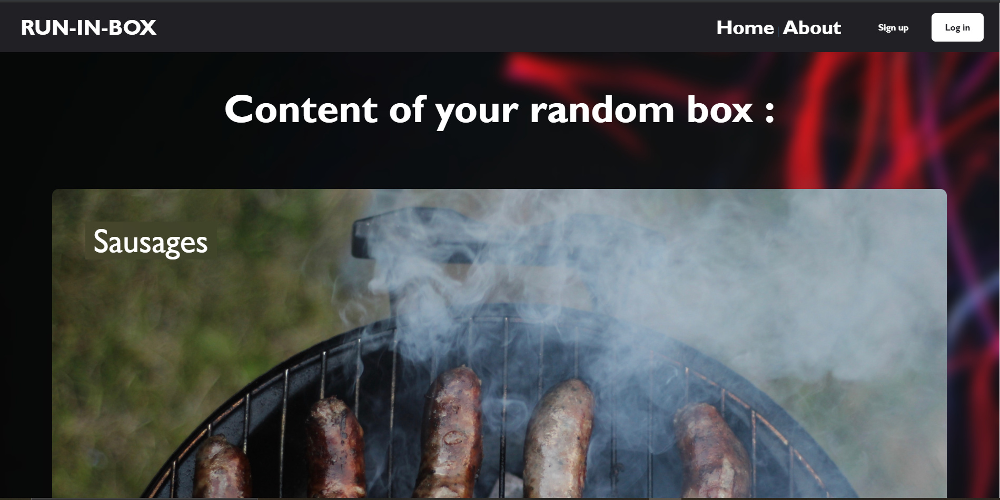

# Run-In-Box
A fullstack e-commerce website that will generate a random gift box for you, that you can save and order every month. 
The frontend was made using Vue.js 3.0 with full mobile compatibility as you have a hamburger menu that expand when you are on a mobile device.
The backend uses Node.js with POST and GET requests. It also handles connections with tokens using the jwt, JSON web token, library to make sure a user can stay connected if he reload the page within the validity period of the token.

# Landing page ( home page )
When you arrive on the website you can see the content of your random box displayed as you can scroll down to see all of its content. On the top-right corner you have the possibility to log in your account or sign up if you don't. You can also have access to the About page to learn more about the purpose of the website.

     
# Sign up
You have to possibility to sign up to be able to order your box.

     
# Login
If you already have an account you can simply log in

# Mobile compatibility
The website is fully mobile-responsive and was designed in a mobile-first approach. The UI will change to better fit the device.

